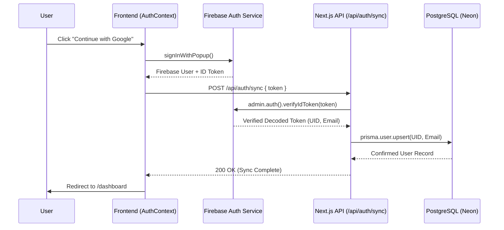

# 🔐 Authentication System Guide: Psykho (The Sanctuary)

This guide documents the **Clean Architecture** authentication flow that synchronizes Firebase users with our PostgreSQL database.

---

## 🏗 High-Level Architecture

Our system follows a **Uni-directional Sync** pattern:
1. **Frontend**: Authenticates the user with Firebase (Google Popup).
2. **Backend**: Verifies the ID Token and Upserts (Create/Update) the user in PostgreSQL.

---

## 📂 File Structure & Responsibilities

### 1. Frontend (Infrastructure & Services)
- **[firebase/client.ts](file:///Users/yahiaelmarbouh/yahyaWork/training/psykho/src/lib/firebase/client.ts)**: Initializes the standard Firebase Web SDK.
- **[ClientAuthService](file:///Users/yahiaelmarbouh/yahyaWork/training/psykho/src/services/client-auth-service.ts)**: A pure service class that wraps Firebase methods. 
    - `loginWithGoogle()`: Triggers the popup.
    - `syncUserWithBackend(token)`: Sends the ID token to our API.

### 2. Frontend (Provider & State)
- **[AuthProvider](file:///Users/yahiaelmarbouh/yahyaWork/training/psykho/src/components/providers/auth-provider.tsx)**: The "Manager". It listens to Firebase's `onAuthStateChanged` and provides the context (`user`, `login`, `logout`) to the whole app.

### 3. Backend (Verification & DB Sync)
- **[firebase/admin.ts](file:///Users/yahiaelmarbouh/yahyaWork/training/psykho/src/lib/firebase/admin.ts)**: Initializes the Firebase Admin SDK for secure server-side operations.
- **[AuthService](file:///Users/yahiaelmarbouh/yahyaWork/training/psykho/src/services/auth-service.ts)**: Contains the core logic:
    - Verifies the token.
    - Extracts `uid` and `email`.
    - Performs the `prisma.user.upsert`.
- **[api/auth/sync/route.ts](file:///Users/yahiaelmarbouh/yahyaWork/training/psykho/src/app/api/auth/sync/route.ts)**: The controller that handles the POST request and calls the `AuthService`.

---

## 🛡 Security Measures
- **Server-Side Verification**: We never trust the UID sent by the client. We only trust the `ID Token`, which is verified by the Private Key in our Firebase Admin SDK.
- **Prisma Upsert**: Ensures that if a user logs in multiple times, we only create the record once and update their email if it changed.
- **Client-Side Protection**: The **[dashboard/layout.tsx](file:///Users/yahiaelmarbouh/yahyaWork/training/psykho/src/app/dashboard/layout.tsx)** checks if a user is logged in. If not, it redirects them to `/login`.

---

## 🛠 Troubleshooting & Maintenance

- **Invalid API Key**: Check `.env` for `NEXT_PUBLIC_FIREBASE_API_KEY`.
- **Sync Fails (500 Error)**: Ensure your `FIREBASE_PRIVATE_KEY` in `.env` is correct and includes the `\n` characters.
- **Database Connection**: Ensure `DATABASE_URL` is configured for Neon PostgreSQL.

> [!TIP]
> **Adding New User Fields?**  
> If you want to store more data (like user preferences), update the `User` model in `prisma/schema.prisma`, run `npx prisma migrate dev`, and update the `upsert` logic in `src/services/auth-service.ts`.
